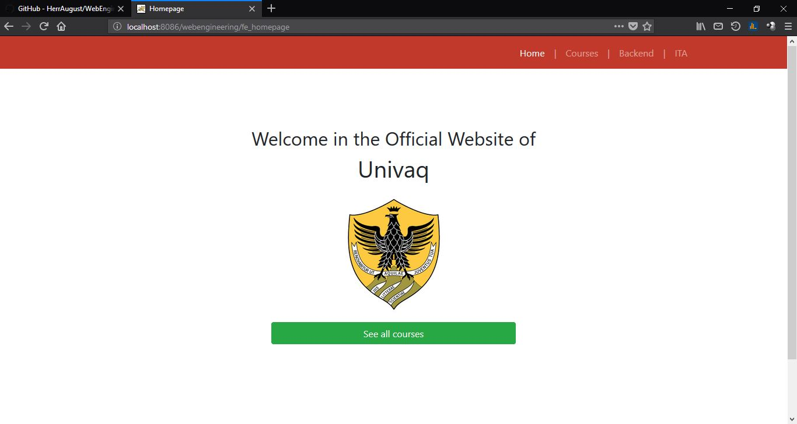

# Web-Engineering
Project of course Web Engineering, 2017
Technology: Java Servlet, CSS3, HTML5, Javascript

# How to develop
- Download Netbeans for Web Development
- Retrieve on the internet the JSON library https://search.maven.org/#search%7Cga%7C1%7Cg%3A%22org.json%22
- Retrieve the Freemarker library https://freemarker.apache.org/freemarkerdownload.html
- Retrieve the MySQLConnector (driver) library https://dev.mysql.com/downloads/connector/j/5.1.html
- Save these libraries on your hard drive
- Import this project into Netbeans 
- Right-click on WebEngineering (or whatever project name)
- Click Properties
- Add these downloaded libraries
- Run the project on your browser

# Preview
- Homepage

- Courses

- Course details

- Backend: list of courses

- Backend: add a course

- Standards compliant
